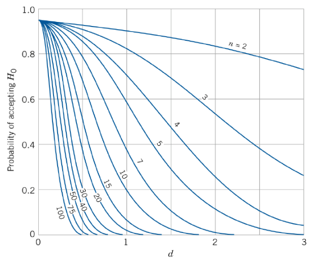

# Introduction to Statistical Method

## Comparing Two Means and Two Variances

### Comparing Two Means - A Point Estimator

We have two populations with different means $\mu_1$ and $\mu_2$, the goal is to estimate the difference $\mu_1 - \mu_2$ by taking a sample from each population in independent way.

Natural point estimator: $\hat{\mu_1 - \mu_2} := \hat {\mu_1} - \hat{\mu_2} = \overline X_1 - \overline X_2$

To determine confidence intervals and to test hypothesis we need to know the distribution $\overline X_1 - \overline X_2$

### Theorem

The $\overline X_1$ and $\overline X_2$ be the sample means based on independent random samples of size $n_1$ and $n_2$ drawn from normal distributions with mean $\mu_1$ and $\mu_2$ and variance $\sigma_1^2$ and $\sigma^2_2$.

The $\overline X_1 - \overline X_2$ is normal with mean $\mu_1 - \mu_2$ and variance $\sigma^2_1/n_1 + \sigma_2^2/n_2$

$\begin{align}  \frac {\overline X_1 - \overline X_2 - (\mu_1 - \mu_2)} {\sqrt {\sigma_1^2/n_1 + \sigma^2_2 / n_2}} \end{align}$ is standard normal random variable.

(Central Limit Theorem allows us to apply this result even to non-normal populations if we have really large sample sizes)

### OC Curve Application

$\begin{align} d= \frac {|\mu_1 - \mu_2|}{\sqrt{\sigma^2_1 + \sigma^2_2}} \end{align}$, if $n = n_1 = n_2$, unchanged, else $\begin{align}n=\frac{\sigma^2_1 + \sigma^2_2}{\sigma^2_1 / n_1 + \sigma^2_2 / n_2}\end{align}$

>   If the variances are unknown, we need some more sophisticated methods.
>
>   The unknown variances are equal, situation is much easier.

### Comparing Two Variances

Consider test types of this:

-   $H_0: \sigma_1^2 = \sigma_2^2$, $H_1 : \sigma_1^2 > \sigma_2^2$ (right-tailed test)
-   $H_0:\sigma_1^2 = \sigma_2^2$, $H_1 : \sigma_1^2 \neq \sigma^2_2$ (two-tailed test)

we move the $\sigma$ to one side to consider only about the quotient.

>   $(n-1)S^2/\sigma^2$ follows a chi-squared distribution with $n-1$ degree of freedom.
>
>   If the variance is put into quotient, it is easier to handle

### F-Distribution

$X_{\gamma_1}^2$ and $X_{\gamma_2}^2$ are independent chi-squared random variables with $\gamma_1$ and $\gamma_2$ degrees of freedom.

Random variable $\begin{align} F_{\gamma_1, \gamma_2} = \frac {X_{\gamma_1}^2 / \gamma_1}{X_{\gamma_2}^2/\gamma_2} \end{align}$ is said to follow a F-distribution with $\gamma_1$ and $\gamma_2$ degree of freedom.

$P[F_{\gamma_1,\gamma_2} < x] = P[1/F_{\gamma_1, \gamma_2} > 1/x] = 1-P[F_{\gamma_2, \gamma_1} < 1/x]$

Then $\begin{align} f_{\gamma_1, \gamma_2}(x) = \gamma_1 ^{\gamma_1 / 2}\gamma_2 ^{\gamma_2/2}\frac {\Gamma(\frac {\gamma_1 + \gamma_2}2)}{\Gamma(\frac{\gamma_1}2)\Gamma(\frac {\gamma_2}2)} \frac{x^{\gamma_1/2-1}}{(\gamma_1x+\gamma_2)^{(\gamma_1 + \gamma_2)/2}}  \end{align}$ for $x \geq 0$

Define $f_{\alpha, \gamma_1,\gamma_2}$ by $P[F_{\gamma_1,\gamma_2} > f_{\alpha, \gamma_1,\gamma_2}] = \alpha$

Then $\begin{align}1-\alpha &= P[F_{\gamma_1,\gamma_2} \geq f_{1-\alpha,\gamma_1,\gamma_2}] \\&=1-P[F_{\gamma_1,\gamma_2} < f_{1-\alpha, \gamma_1, \gamma_2}] \\&= P[F_{\gamma_2,\gamma_1}< 1/f_{1-\alpha, \gamma_1, \gamma_2}] \\&= 1- P[F_{\gamma_2, \gamma_1} \ge 1/f_{1-\alpha,\gamma_1,\gamma_2}] \end{align}$ also we can see $\alpha = P[F_{\gamma_2,\gamma_1} \geq f_{\alpha,\gamma_2,\gamma_1}]$.

So $f_{1-\alpha,\gamma_1,\gamma_2} \cdot f_{\alpha,\gamma_2,\gamma_1} = 1$.

### Remark

Let $S_1^2$ and $S_2^2$ be sample variance based on independent random samples of size $n_1$ and $n_2$ from normal populations with means $\mu_1$ and $\mu_2$ and variance $\sigma_1^2$ and $\sigma_2^2$.

If $\sigma^2_1 = \sigma_2^2$ then the statistic $S^2_1/S^2_2$ follows F-distribution with $n_1 - 1$ and $n_2-1$ distribution.

Since $\begin{align}F_{n_1-1,n_2-1} = \frac{[(n_1-1)S_1^2/\sigma_1^2] / (n_1-1)}{[(n_2-1)S^2_2/\sigma_2^2]/(n_2-1)} = \frac {\sigma_2^2S_1^2}{\sigma_1^2S_2^2} \end{align}$, so it is trivial to require $\sigma_1^2 = \sigma_2^2$

### F-Test

We can derive F-Test from F-distribution that:

$H_0 :\sigma_1 = \sigma_2$ based on $F_{n_1-1,n_2-1} = \frac {S_1^2}{S_2^2}$ is a F-Test

We reject $H_0$ at significance level $\alpha$

-   in favor of $H_1: \sigma_1 > \sigma_2$ if $\frac {S_1^2}{S_2^2} > f_{\alpha, n_1-1,n_2-1}$
-   in favor of $H_1: \sigma_1<\sigma_2$ if $\frac{S^2_2}{S_1^2} > f_{\alpha,n_2-1,n_1-1}$
-   in favor of $H_1: \sigma_1 \neq \sigma_2$ if $\frac{S_1^2}{S_2^2} > f_{\alpha / 2, n_1-1, n_2-1}$ or $\frac{S^2_2}{S_1^2} > f_{\alpha/2, n_2-1, n_1-1}$

When testing to see whether two population variances are equal for the purpose of comparing their means, one hopes to not reject $H_0$.

If $H_0$ is not rejected, one can assume that the variances are in fact equal and continue with the test for equality for means.

In this case, a small Type II error $\beta$ is more important than $\alpha$ small.

### OC Curves for F-Test

For case $n = n_1 = n_2$, the OC curves plotting $\beta$ against the parameter $\lambda = \frac {\sigma_1}{\sigma_2}$.

The curves are for both one- two- sided alternatives.

### Comparing Two Means - Equal Variances

$\begin{align}  \frac {\overline X_1 - \overline X_2 - (\mu_1 - \mu_2)} {\sqrt {\sigma_1^2/n_1 + \sigma^2_2 / n_2}} \end{align}$ follows standard normal distribution.

We now want to estimate $\sigma^2$.

The pooled estimator is $\begin{align} S_p^2 = \frac{(n_1 - 1)S_1^2 + (n_2-1)S^2_2}{n_1+n_2-2} \end{align}$

$\begin{align}X_{n_1+n_2-2}^2 = \frac{(n+1+n_2-2)S_p^2}{\sigma^2} = \frac{(n_1-1)S_1^2}{\sigma^2} + \frac{(n_2-1)S_2^2}{\sigma^2}\end{align}$

Furthermore, $\begin{align} T_{n_1+n_2-2} = \frac Z{\sqrt{X^2_{n_1+n_2-2} / (n_1+n_2-2)}} = \frac{(\overline X_1 - \overline X_2) - (\mu_1 - \mu_2)}{\sqrt{S^2_p(1/n_1+1/n_2)}} \end{align}$ follows T-distribution with $n_1 + n_2-2$ degree of freedom.

So the $100(1-\alpha)\%$ confidence interval for $\mu _1 - \mu_2$ is $(\overline X_1 - \overline X_2) \pm t_{\alpha/2, n_1 + n_2-2}\sqrt{S_p^2(1/n_1+1/n_2)}$

### Pooled T-Test - Variance Equal

Let $X_1^{(i)}..X_{n_i}^{(i)}$, $i = 1,2$ be random samples of size $n_i$ from two normal distributions with means $\mu_i$ and identical $\sigma^2$.

$S_p^2$ be the pooled sample variance and $(\mu_1 - \mu_2)_0$ a null value for difference of means.

Then Test $H_0:\mu_1 - \mu_2 = (\mu_1  - \mu_2)_0$ based on $\begin{align} T_{n_1+n_2-2} =  \frac{(\overline X_1 - \overline X_2) - (\mu_1 - \mu_2)}{\sqrt{S^2_p(1/n_1+1/n_2)}} \end{align}$ is a pooled test for equality of means.

We reject $H_0$ at significance level $\alpha$

-   in favor of $H_1: \mu_1 - \mu_2 \neq (\mu_1 - \mu_2)_0$ if $|T_{n_1 + n_2 - 2} | > t_{\alpha / 2, n_1 + n_2 - 2}$
-   in favor of $H_1: \mu_1 - \mu_2 > (\mu_1 - \mu_2)_0$ if $T_{n_1 + n_2 - 2} > t_{\alpha , n_1+n_2-2}$
-   in favor of $H_1: \mu_1 - \mu_2 < (\mu_1 - \mu_2)_0$ if $T_{n_1 + n_2 - 2}  <- t_{\alpha , n_1+n_2-2}$

### OC Curves T Test - Variance Equal

Equal variance $\sigma^2$ and equal sample size $n_1 = n_2 = n$, $d = \frac {|\mu_1 - \mu_2|}{2\sigma}$, we must use the modified sample size $n^* = 2n-1$. The $\sigma$ can be substitute with an estimated one or express the deviation in terms of $\sigma$.

### Unequal Variances

$\begin{align}  \frac {\overline X_1 - \overline X_2 - (\mu_1 - \mu_2)} {\sqrt {\sigma_1^2/n_1 + \sigma^2_2 / n_2}} \end{align}$ for the unequal variance $\sigma_1$ and $\sigma_2$, we can estimate the variance to get the statistic $\begin{align} T_{\gamma} = \frac {(\overline X_1 - \overline X_2) - (\mu_1 - \mu_2)_0}{\sqrt{S^2_1/n_1 + S^2_2/n_2}} \end{align}$ where the $\gamma$ for the degree of freedom is $\begin{align}\gamma = \frac {(S_1^2 / n_1 + S_2^2/n_2)^2}{\frac{(S_1^2/n_1)^2}{n_1-1} + \frac{(S_2^2/n_2)^2}{n_2-1}} \end{align}$

### Pooled T-Test - Variances Unequal

We reject $H_0$ at significance level $\alpha$

-   in favor of $H_1: \mu_1 - \mu_2 \ne (\mu_1 - \mu_2)_0$ if $|T_\gamma| > t_{\alpha/2,\gamma}$
-   in favor of $H_1: \mu_1 - \mu_2 > (\mu_1 - \mu_2)_0$ if $T_\gamma > t_{\alpha,\gamma}$
-   in favor of $H_1: \mu_1 - \mu_2 < (\mu_1 - \mu_2)_0$ if $T_\gamma  <-t_{\alpha,\gamma}$

### Paired T-Test

