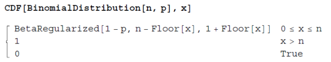

# Elements of Probability Theory

## Discrete Random Variables

### Random Variables

-   they are **not random**
-   they are **not variables**
-   they are in fact **functions**

#### A random variable is in fact a function.

-   Donated by $X$.
-   Maps a **sample space** into a subset $\Omega \subset \mathbb{R}$.

#### A probability density function is accompanied to $X$ to introduce random part

-   Donated by $f_X$.
-   Associate a certain **"probability density"** to each element in the range of $X$.

### Discrete Random Variables

#### discrete random variable

-   $S$ is a sample space and $\Omega \subset \mathbb{Z}$.
-   **discrete random variable**: $X: S \to \Omega$.
-   **probability density function / distribution function**: $f_X: \Omega \to R$.
-   $f_X(x) \geq 0, \forall x \in \Omega$.
-   $\sum_{x \in \Omega} f_X(x) = 1$.

#### Remark.

-   A random variable is best thought as being a pair $(X, f_X)$.

-   Density $f_X$ is interpreted as the probability that $X$ assumes a given value $x$, denoted as:

    $f_X(x) = P[\{X = x\}] = P[p]$

    where $X(p) = x$ for $p \in S$.

### Cumulative Distribution

#### cumulative distributive function

-   $F(x) = P[X \leq x] = \sum_{y \leq x} P[X = y] = \sum_{y \leq x} f_X(y)$

<div style="page-break-after: always;"></div>

### Expectation

#### expectation for discrete random variable

-   discrete random variable $(X, f_X)$
-   **Expected value** of $X$ is $E[X] = \sum_{x \in \Omega} x \cdot f_X(x)$.

#### St. Petersburg Paradox

-   The expectation is $E[W] = \sum_{i \in \mathbb{N}^* }\frac{1}{2^n} \cdot 2^n = \infty$.
-   Actually do not make sense according previous definition.
-   So we need new definition and ideas for expectation.

#### Expected Value of $H \circ X$

-   discrete random variable $(X, f_X)$

-   $H: \Omega \to \mathbb{R}$

-   The composition $H \circ X$ will again be a random variable, albeit with **different probability density function**.

    ($H \circ X: S \to \Omega \to \mathbb{R}$, so range changed.)

-   $H \circ X$ will be discrete if $X$ is discrete.

-   **Expected value** of $H \circ X$ is $E[H\circ X] = \sum_{x \in \Omega} H(x) \cdot f_X(x)$.

#### Some Properties of the Expectation


-   Given random variable $S \to \mathbb{R}$ given by $p \mapsto c$.

    $\forall p \in S$ and a fixed number $x \in \mathbb{R}$.

    Then $E[c] = c$.

-   Let $X$ be a random variable and $c \in \mathbb{R}$.

    The composition of function $H: R \to R, y \mapsto c \cdot y$ with $X$ is a random variable.

    So $H \circ X = c \cdot X$.

    Then $E[c \cdot X] = c \cdot E[X]$.

-   Let $X$ and $Y$ be random variable.

    Then $E[X+Y] = E[X] + E[Y]$.


<div style="page-break-after: always;"></div>

### Variance

>    Variance is a method to get the expected deviation from the mean.

-   The variance of a random variable $X$ with expectation $E[X]$ is defined as

    $Var$ $X$ = $E[(X-E[X])^2]$

-   **Notation**:

    $E[X] = \mu_X = \mu$, $Var$ $X$ = $\sigma_X^2$ = $\sigma^2$

-   Transform:

    $Var\text{ }X = E[(X-E[X])^2]=\frac{1}{n}\sum_{i}(x_i - E[X])^2\\=\frac{1}{n} (\sum_ix_i^2 + nE[X]^2-2E[X]x_i)\\=E[X^2] + E[X]^2-2E[X]^2\\=E[X^2]-E[X]^2$

#### Standard Deviation

-   Let $X$ be a random variable variance $\sigma_X^2$.
-   The **standard deviation** of $X$ is $\sigma_X = \sqrt{Var\text{ }X} = \sqrt{\sigma_X^2}$.

#### Some Properties of the Variance

-   Given random variable $S \to \mathbb{R}$ given by $p \mapsto c$.

    $\forall p \in S$ and a fixed number $x \in \mathbb{R}$.

    Then $Var$ $c  = 0$.

-   Let $X$ be a random variable and $c \in \mathbb{R}$.

    The composition of function $H: R \to R, y \mapsto c \cdot y$ with $X$ is a random variable.

    So $H \circ X = c \cdot X$.

    Then $Var$ $cX = c^2Var$ $X$.

-   Let $X$ and $Y$ be random variable that are independent.

    Then $Var[X+Y] = Var[X] + Var[Y]$.

<div style="page-break-after: always;"></div>

### Geometric Distribution

#### Properties

-   The experiments consists of a series of **trials**.

    **Outcome** of trials can be classed as:

    -   **success (s)**
    -   **failure (f)**

    A trial with this property is a **Bernoulli trial**.

-   The trials are **identical** and **independent** in the sense that the outcome of one trial has **no effect on the outcome of any other**.

    The probability of success, $p$, remain the same for each trial.

-   The random variable $X$ donates the number of trials needed to obtain the first success.

#### Definition

-   Random variable $(X, f_X)$ is given by

    $X: S \to \Omega = \mathbb{N} \backslash\{0\}$.

-   Distribution function $f_X:\mathbb{N}\backslash\{0\}\to \mathbb{R}$ is given by

    $f_X(n) = (1-p)^{n-1}p$ with $0 < p < 1$

    is said to have a **geometric distribution with parameter $p$**.

#### Lemma of Cumulative Distribution for Geometrically Distributed Random Variable

-   Given **geometrically distributive random valuable** $(X, f_X)$ with parameter $p$.

-   The cumulative distribution function is

    $F(x) = P[X \leq x] = 1-(1-p)^{\lfloor x\rfloor}$.

<div style="page-break-after: always;"></div>

#### (Mathematica) Properties and the Geometric Distribution

##### Mathematica Probability Density Function ($f_X$)

```mathematica
PDF[GeometricDistribution[p], x]
(1 - p)^x p      x >= 0
0                True
```

```mathematica
PDF[GeometricDistribution[p], 4]
(1 - p)^4 p
```

##### `Probability` Function

Used to find probability $P[a \leq x \leq b]$.

```mathematica
Probability[1 < x <= 4, x = GeometricDistribution[p]]
(-1 + p)^2 p (3 - 3p + p^2)
```

```mathematica
Probability[x == 4, x = GeometricDistribution[p]]
(-1 + p)^4 p
```

<div style="page-break-after: always;"></div>

### Moments of a Random Variable

>   A tools allows us to **employ all power of calculus** to finding the expectation value and variance for a geometric random variable.

-   Random variable $(X, f_X)$.

-   For $k \in \mathbb{N}$, the $k^{th}$ **ordinary moment** of $X$ is defined as $E[X^k]$.

    (For $k=0$ we set $E[X^0] = E[1] = 1$)

So the **key** to find the expectation and variance of $X$ lies in finding its **moments**.

(Check the structure for $Var$ $X = E[X^2] - E[X]^2$)

##### Moment Generating Function

-   Random variable $(X, f_X)$.
-   $E[X^k]$ is the $k^{th}$ **ordinary moment** of $X$.


###### :idea: Definition

So if power series $m_X(t) := \sum^\infty_{k=0} \frac{E[X^k]}{k!}t^k$ has a radius of convergence $\varepsilon > 0$,

the function is **defined** with $m_X: (-\varepsilon, \varepsilon) \to \mathbb{R}$

is a **moment generating function**.

###### :idea: Theorem

-   The moment-generating function exists $iff.$ $E[e^{tX}]$ exists, in which case

    $m_X(t) = E[e^{tX}]$

-   Furthermore,

    $E[X^k] = \frac{d^k m_X(t)}{dt^k} \Big|_{t=0}$

###### :idea: Proof for Definition and Theorem

$m_X(t) = \sum^\infty_{n=0} \frac{t^n}{n!}E[X^n] = \sum^\infty_{n = 0}E[\frac{t^n}{n!}\cdot X^n]=E[e^{tX}]$.

By **Properties of the Expectation** and the exponential series converges for any $t \in (-\varepsilon, \varepsilon)$, proved.

$\frac{d^k m_X(t)}{dt^k} = \sum ^ \infty_{n=0}\frac{d^k}{dt^k}\frac{t^n \cdot E[X^n]}{n!} = \sum^\infty_{n=0}(\frac{d^k}{dt^k}\frac{t^n}{n!})E[X^n] = \sum_{n=k}^\infty\frac{t^{n-k}}{(n-k)!}E[X^n]$.

Thus $\frac{d^k m_X(t)}{dt^k}\Big|_{t=0} = E[X^k]$.

<div style="page-break-after: always;"></div>

### Applying M.G.F to the Geometric Distribution

>   The association "distribution $\mapsto$ m.g.f" is essential.

If we know a given distribution $g$ has a certain **m.g.f** and some **random variable** $(X, f_X)$ has same **m.g.f**, then $f_X = g$.

#### Proposition

-   $(X, f_X)$ is a **geometrically distributed random variable** with parameter $p$.

-   **M.G.F** for $X$ is given by:

    $m_X: (-\infty, -ln(q)) \to \mathbb{R}, m_X(t) = \frac{pe^t}{1-qe^t}, q=1-p$

#### Proof for Proposition

-   Let $f_X(x) = q^{x-1}p$ for $x \in \mathbb{N} \backslash \{0\}$.

-   So we get $m_X(t)$ as:

    $m_X(t) = E[e^{tX}] = \sum^\infty_{x=1} e^{tx} \cdot q^{x-1}p = \frac{p}{q}\sum_{x=1}^\infty(qe^t)^x$.

-   So it only converge for $|qe^t| = qe^t < 1$ $(q > 0)$, or $t < -ln(q)$.

-   So $m_X(t) = \frac{p}{q} \sum^\infty_{x=1} (qe^t)^x = \frac{p}{q}(\sum^\infty_{x=0}(qe^t)^x-1) = \frac{p}{q}(\frac{1}{1-qe^t} - 1) =  \frac{pe^t}{1-qe^t}$.

#### Application

-   $(X, f_X)$ is a **geometrically distributed random variable** with parameter $p$.

-   The **expectation value** and **variance** are

    $E[X] = \frac{1}{p}$ and $Var$ $X = \frac{q}{p^2}$ ($q = 1-p$)

#### Proof for the application

$E[X] = \frac{d}{dt}\Big|_{t=0} m_X(t) = \frac{d}{dt}\Big|_{t=0} \frac{pe^t}{1-qe^t} = \frac{pe^t(1-qe^t)+pe^tqe^t}{(1-qe^t)^2}\Big|_{t=0} = \frac{p}{(1-q)^2} = \frac{1}{p}$.

$Var$ $X$ = $E[X^2]-E[X]^2$

$E[X^2] = \frac{d^2}{dt^2}\Big|_{t=0}\frac{pe^t}{1-qe^t} = \frac{d}{dt}\Big|_{t=0} \frac{pe^t}{(1-qe^t)^2} = \frac{pe^t(1+qe^t)}{(1-qe^t)^3}\Big|_{t=0} = \frac{2-p}{p^2}$.

Thus $Var$ $X = \frac{q}{p^2}$.

<div style="page-break-after: always;"></div>

### Binomial Distribution

#### Properties

-   The experiment consists of a **fixed number** $n$ of **Bernoulli trials**.

-   The trials are **identical** and **independent**.

    The **probability of success**, $p$, remains the **same** for each trial.

-   The random variable $X$ denotes **the number of successes** in the $n$ trials.

#### Definition

-   Random variable $(X, f_X)$ is given by

    $X: S \to \Omega = \{0, 1, 2, ..., n\}$.

-   Distribution function:  $f_X:\mathbb{N}\backslash\{0\}\to \mathbb{R}$ is given by

    $f_X(x) = \binom n x p^x(1-p)^{n-x}$ with $0<p<1$ and $n \in \mathbb{N}\backslash\{0\}$

    is said to have a **binomial distribution with parameters** $n$ and $p$.

#### Expectation and Variance

##### Theorem

Given **binomial random** variable $(X, f_X)$ with parameters $n$ and $p$.

-   The **M.G.F** of $X$ is given by

    $m_X: \mathbb{R} \to \mathbb{R}, m_X(t) = (q+pe^t)^n, q=1-p$.

-   $E[X] = np$ and $Var$ $X = npq$.

##### Proof

-   $m_X(t) = E[e^{tX}] = \sum^n_{x=0}e^{xt}\binom n x p^x q ^{n-x} = \sum^n_{x=0}\binom n x (e^tp)^xq^{n-x}=(e^tp + q)^n$.

-   $E[X] = \frac{d}{dt} \Big|_{t=0}(e^tp+q)^n = n (e^tp+q)^{n-1}pe^t \Big|_{t=0} = np$.

-   $E[X^2]=\frac{d}{dt}\Big|_{t=0} n(e^tp+q)^{n-1}pe^t = n(e^tp+q)^{n-1}pe^t + n(n-1)(e^tp+q)^{n-2}(pe^t)^2\Big|_{t=0}\\ = np+n(n-1)p^2$

    So $Var$ $X= E[X^2]-E[X]^2=np + n^2p^2-np^2-n^2p^2 = np(1-p) = npq$.

#### Cumulative Distribution Function

>   There is no simple way of evaluating the sums involved, so the values have been tabulated.

$F(t) = p[X \leq t] = \sum^{\lfloor t \rfloor}_{x=0}\binom n x p^x (1-p)^{n-x}$.

`Mathematica` command for $F$ is **CDF**:



<div style="page-break-after: always;"></div>

### Pascal Distribution

#### Properties

-   The experiment consists of a series of **Bernoulli trials**.

-   The trials are **identical** and **independent**.

    The **probability of success**, $p$, remains the **same** for each trial.

-   The trials are observed until **exactly $r$ success are obtained**. ($r$ is fixed beforehand)

-   The random variable $X$ is **the number of trials needed** to obtain the $r$ successes.


#### Definition

-   $r \in \mathbb{N} \backslash\{0\}$.

-   Random variable $(X, f_X)$ is given by

    $X: S \to \Omega = \mathbb{N}\backslash\{0, 1, 2, ..., r\}=\{r, r+1, r+2, ...\}$.

-   **distribution function**:

    $f_X: \Omega \to \mathbb{R}, f_X(x) = \binom {x-1} {r-1} p^r (1-p)^{x-r}$, $0<p<1$.

    -   Proof:

        So we know $x$ trials for $r$ successes exactly, is equals to the fact:

        $P[\text{obtain $r^{th}$ success in $x^{th}$ trial}] = P[\text{exactly $r-1$ success in $x-1$ trials}] \times p$

        Since $P[\text{exactly $r-1$ success in $x-1$ trials}] = \binom {x-1} {r-1} p^{r-1} (1-p)^{x-r}$.

        So we know $P[\text{obtain $r^{th}$ success in $x^{th}$ trial}] = \binom {x-1} {r-1} p^r (1-p)^{x-r}$.

#### Theorem of M.G.F on Pascal Distribution

-   **M.G.F** of $X$ is given by $m_X: \mathbb{R} \to \mathbb{R}, m_X(t) = \frac{(pe^t)^r}{(1-qe^t)^r}$, $q=1-p$.
-   $E[X] = \frac{r}{p}$.
-   $Var$ $X = \frac{rq}{p^2}$.

#### Theorem Proof

$m_X(t)= E[e^{tX}] = \sum^\infty_{x=r}\binom {x-1} {r-1}p^r(1-p)^{x-r}e^{tx}\\= \sum ^\infty_{x=0}\binom {x+r-1} {r-1}p^r(1-p)^xe^{t(x+r)}\\=p^re^{tr}\sum^\infty_{x=0}\binom{r-1+x} x [e^t(1-p)]^x$

Then we can transform $\binom{r-1+x}x = \frac{(r+x-1)!}{x!(r-1)!} = \frac{(r+x-1) .. r}{x!} = (-1)^x\frac{(-r) .. (-r-x+1)}{x!} = (-1)^x\binom {-r} x$.

So $m_X(t) = p^re^{tr}\sum^\infty_{x=0}\binom{r-1+x} x [e^t(1-p)]\\= p^re^{tr}\sum^\infty_{x=0} \binom {-r} x[-e^t(1-p)]^x\\= p^re^{tr}(1-e^t(1-p))^{-r}=\frac{(pe^t)^r}{(1-qe^t)^r}$

And the rest can be achieved easily.

<div style="page-break-after: always;"></div>

#### Pascal Distribution Question

>   The president of a large corporation makes decisions by throwing darts at a board. The center section is marked “yes” and represents a success. The probability of his hitting a “yes” is 0.6., and this probability remains constant from throw to throw. The president continues to throw until he has three “hits.”
>
>   The president’s decision rule is simple: If he gets three hits on or before the fifth throw he decides in favor of the question. What is the probability that he will decide in favor?

So we get $\sum_{x=3} ^5 \binom{x-1}2 (0.6)^3(0.4)^{x-3} = 0.6826$.

<div style="page-break-after: always;"></div>

### Hypergeometric Distribution

>   The hypergeometric distribution concerns trials that are **not** independent.
>
>   So each **trial** might influence the rest **trials**.

#### Properties

-   Experiment consists of drawing **a random sample** of size $n$ without **replacement** and without regard to order from a collection of $N \geq n$ objects.
-   Of the $N$ objects, $r$ have a trait that interests us, while other $N-r$ do not.
-   The random variable $X$ is **the number of objects in the sample with the trait**.

####  Definition

-   $N, n, r \in \mathbb{N}\backslash\{0\}$, $r, n \leq \mathbb{N}$.

-   Random variable $(X, f_X)$:

    -   $X: S \to \Omega = \{x \in \Omega: max(0, n- (N - r)) \leq x \leq min(n, r)\}$
        -   if $n$ is larger than $N-r$, then it will certainly get one of $r$, so size is $n-(N-r)$.
        -   if $n$ is smaller than $r$, then it can only be as large as $n$.
    -   $f_X: \Omega \to \mathbb{R}, f_X(x) = \frac{\binom{r} {x} \binom{N-r}{n-x}}{\binom{N}{n}}$
        -   $ \binom{r} {x}$ is ways to choose $x$ from $r$ objects. ($x$ interested in the taken $n$ objects)
        -   $\binom{N-r}{n-x}$ is ways to choose $n-x$ from $N-r$ objects. ($n-x$ uninterested from taken $n$ objects)

    is said to have a **hypergeometric distribution** with parameters $N, n$ and $r$.

    -   $\binom{a+b}{r} = \sum^r_{k=0} \binom a k \binom b {r-k}$

        $\sum^{a+b}_{r=0}\binom{a+b}rx^r = (1+r)^{a+b} = (1+r)^a(1+r)^b = (\sum^a_{i=0}\binom a i x^i)(\sum_{j=0}^b\binom b j x^j)\\=\sum^{a+b}_{r=0}\sum_{i+j=r}\binom ai\binom bj x^r$

<div style="page-break-after: always;"></div>

#### Mean / Expectation and Variance

-   $(X, f_X)$ be a **hypergeometric distribution** with parameter $N, n$ and $r$.
-   $E[X] = n\frac{r}{N}$
-   $Var$ $X = n\frac{r}{N} \frac{N-r}{N}\frac{N - n}{N - 1}$

##### Proof

$E[X]=\sum^n_{x=0}x\frac{\binom rx \binom {N-r}{n-x}}{\binom Nn} = \sum^n_{x=0}r\frac{\binom{r-1}{x-1}\binom{(N-1)-(r-1)}{(n-1)-(x-1)}}{\frac{N}n\binom{N-1}{n-1}} = \frac{nr}N\sum_{x=1}^n\frac{\binom{r-1}{x-1}\binom{(N-1)-(r-1)}{(n-1)-(x-1)}}{\binom{N-1}{n-1}} = \frac{nr}N$.

$E[X^2] = E[X(X-1)]+E[X]$, so consider $E[X(X-1)]$:

$E[X(X-1)] = \sum^n_{x=0}x(x-1)\frac{\binom r x\binom{N-r}{n-x}}{\binom Nn} = \sum^n_{x=0}r(r-1)\frac{\binom{r-2}{x-2}\binom{(N-2)-(r-2)}{(n-2)-(x-2)}}{\frac Nn\frac{N-1}{n-1}\binom{N-2}{n-2}} = \frac{n(n-1)r(r-1)}{N(N-1)}$.

Thus we get the result.

#### Approximation of Hypergeometric Distribution

If the **sampling fraction** $\frac nN$ is sufficiently small, like $\le 0.05$ or $\le 0.1$, then it can be approximated by a **binomial distribution** with parameter $n$ and $p=\frac{r}{N}$.

The smaller $\frac nN$, the better the approximation.

<div style="page-break-after: always;"></div>

### Poisson Distribution

>   Used for discrete occurrences, called **arrivals**, occurring randomly in a continuous time frame.

#### Some Assumes and pre-definitions

-   random variable is $X_t$ is **number of arrivals in time interval** $[0, t]$ $(t > 0)$.

    $\forall t, X_t: S \to \mathbb{N}$

-   **numbers of arrivals** during a **non-overlapping time interval** $T_1, T_2, T_1 \cap T_2 = \emptyset$ are independent.

-   some number $\lambda > 0$ for any **small time interval** $\Delta t$ with **satisfied postulates**:

    -   the probability that **exactly one arrival** will occur in **an interval of width** $\Delta t$ is approximately $\lambda \cdot \Delta t$.
    -   the probability that **exactly zero arrival** will occur in **the interval** is approximately $1 - \lambda \cdot \Delta t$.
    -   The probability that **two or more arrivals** occur in the interval is approximately zero.

-   for the probability density function $f_{X_t}$, we write

    $f_{X_t}(x) = P[X_t=x]:=p_x(t)$ for $x = 0,1,2,3,...$

-   So **probability of zero arrival** in $[0, t + \Delta t]$ is

    $p_0(t+\Delta t) = (1-\lambda\cdot\Delta t + o(\Delta t))p_0(t) = (1-\lambda\cdot\Delta t)p_0(t) + o(\Delta t)$.

    So $-\lambda \cdot p_0(t) = \frac{1}{\Delta t}(p_0(t+\Delta t) - p_0(t)) = p_0'(t)$.

-   So **probability of $x$ arrivals $(x>0)$** in $[0, t + \Delta t]$ is

    $p_x(t+\Delta t) = (\lambda \cdot \Delta t) \cdot p_{x-1}(t) + (1-\lambda \cdot \Delta t)\cdot p_x(t) + o(\Delta t)$.

    so $\lambda \cdot p_{x-1}(t) - \lambda \cdot p_x(t) = \frac{1}{\Delta t} (p_x(t + \Delta t) - p_x(t)) + \frac{o(\Delta t)}{\Delta t} = p_x'(t)$.

-   the solution is $f_{X_t}(x) = p_x(t) = \frac{(\lambda t)^x}{x!}e^{-\lambda t}$.

-   donate $x = \lambda t$, we get **Poisson distribution with parameter $k$**.

#### Definition

-   $k \in \mathbb{R}$
-   Random variable $(X, f_X)$:
    -   $X: S \to \mathbb{N}$
    -   $f_X: \mathbb{N} \to \mathbb{R}$ given by $f_X(x) = \frac{k^xe^{-k}}{x!}$

    is said to have a **Poisson distribution** with parameter $k$.


#### MGF and Cumulative Distribution Functions

-   Let $(X, f_X)$ be a **Poisson distributed random variable with parameter $k$**.

-   **MGF** of $X$ is given by

    $m_X: \mathbb{R} \to \mathbb{R}, m_X(t) = e^{k(e^t-1)}$.

    $m_X(t) = \sum_{x=0}^{+\infty}f_X(x)\cdot e^{xt} = \sum^{+\infty}_{x=0}\frac{k^xe^{-k}}{x!}e^{xt} = \sum^{+\infty}_{x=0}\frac{(ke^t)^xe^{-k}}{x!} = e^{ke^t-k}$.

-   So $E[X] = k$ and $Var$ $X = k$.

-   cumulative distribution function $F(x) = P[X \leq x] = \sum^{\lfloor x \rfloor}_{p=0}\frac{e^{-k}k^p}{p!}$

#### Approximating Binomial Distribution

If $n$ is large and $p$ is small, we can approximate the binomial distribution by Poisson distribution.

Set $k = pn$, requiring $p < 0.1$ for approximation.

The smaller $p$ and the larger $n$ are, the better approximation.