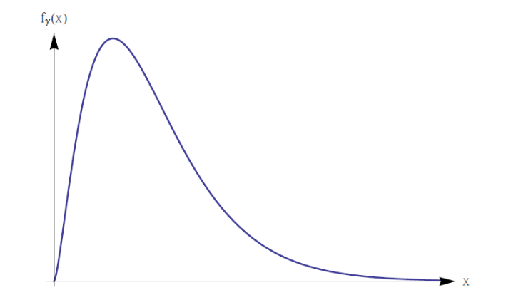
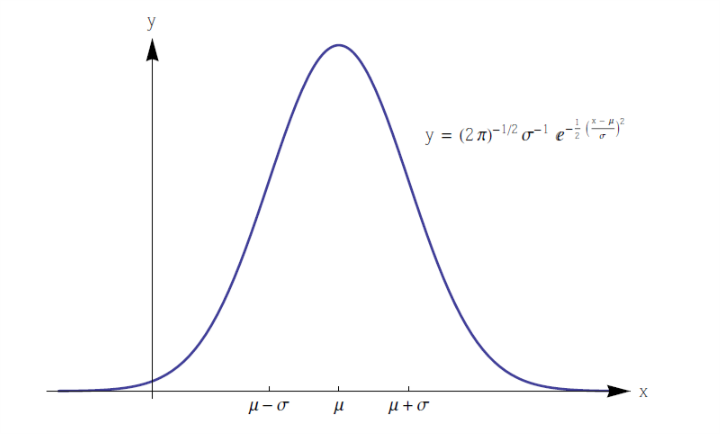
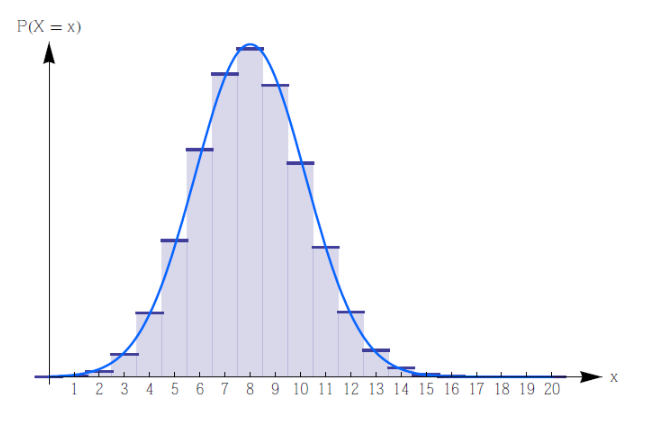

# Elements of Probability Theory

## Continuous Random Variables

### Continuous Random Variables

#### Definition

-   $S$ be a **sample space**.
-   **Continuous** random variable: $X: S \to \mathbb{R}$ with $f_X : \mathbb{R} \to \mathbb{R}$.
    -   $f_X \ge 0$
    -   $\int^\infty_{-\infty} f_X(x) dx = 1$.
-   $f_X$ is called the **probability density function**, or **density** of the random variable $X$.
-   $P[a \le X \le b] = \int ^b_a f_X(x) dx$, means the probability that **$X$ assumes values $x$ in a given range**.
-   The probability that **$X$ assumes any specific value is 0**: $P[X = x] = \int^x_xf_X(y)dy=0$.
-   **Cumulative Distribution**:
    -   Let $(X, f_X)$ be continuous random variable.
    -   $F: \mathbb{R} \to \mathbb{R}$, $F_X(x) := P[X \leq x] = \int^x_{-\infty}f_X(y)dy$ is the **cumulative distribution function**.

#### Remark

-   For two **continuous random variables** $(X, f_X)$ and $(Y, f_Y)$, if $f_X$ and $f_Y$ differ only on **sets of measure zero** (e.g., countable sets), then $\forall a, b \in \mathbb{R}$

    $P[a \le X \le b] = P[a \le Y \le b] = \int^b_af_X(x)dx = \int^b_af_Y(y)dy$.

    We say this $(X, f_X) = (Y, f_Y)$ almost surely.

-   $f_X(x) = F_X'(x)$.

#### Expectation and Variance

-   $(X, f_X)$ be continuous random variable

-   $H: \mathbb{R} \to \mathbb{R}$

-   Expected value of $H \circ X $ is $E[H \circ X ] = \int ^\infty _{-\infty}H(x) \cdot f_X(x)dx$

    (if it converge absolutely)

-   $E[X] = \int_\mathbb{R} x \cdot f_X(x)dx$

-   $Var$ $X = E[X^2]-E[X]^2$

### Exponential Distribution

#### Definition

-   $\beta \in \mathbb{R}, \beta > 0$

-   Continuous random function $(X, f_\beta)$ with density:

    $$f_\beta(x) =\begin{aligned}&\frac{1}{\beta}e^{-x/\beta}, &x > 0\\ &0, &x \leq 0 \end{aligned}$$

    is said to **follow an exponential distribution with parameter $\beta$**.

#### Expectation and Variance

-   $E[X] = \int^{\infty}_{-\infty} x f_\beta (x) dx = \int ^{\infty}_0\frac{x}\beta e^{-x/\beta}dx = -xe^{-x/\beta}\Big|_0^\infty + \int^\infty_0e^{-x/\beta}dx$

    thus $E[X] = 0 + (-\beta) \int ^{x=\infty}_{x=0} e^{-x/\beta}d(-\frac{x}{\beta}) = (-\beta)\int^{-\infty}_0 e^p dp = \beta$

-   $E[X^2] = \int^{\infty}_{-\infty}x^2f_\beta(x)dx = \int ^\infty_0 \frac {x^2}\beta e^{-x / \beta} dx = \int ^{\infty}_0 2xe^{-x/\beta}dx-x^2e^{-x/\beta}\Big|^\infty_0$

    thus $E[X^2] = 2\beta\int ^{\infty}_0 \frac{x}{\beta}e^{-x/\beta}dx - 0 = 2\beta^2$

-   $Var$ $X = \beta^2$

#### MGP

$m_X(t) = E[e^{tX}] = \int ^{\infty}_{-\infty} e^{tx}f_X(x) dx = \int^\infty_0\frac{1}{\beta}e^{-(1/\beta -t)x}dx$ defined only for $t < \frac{1}{\beta}$

so $m_X(t) = \frac{1}{\beta}\frac{-1}{\frac{1}{\beta}-t}\int^\infty_0-(\frac{1}{\beta} - t)e^{-(1/\beta - t)x}dx = \frac{1}{\beta t - 1} e^p \Big|^{-\infty}_0 = \frac{1}{1-\beta t}$

#### Connection to Poisson Distribution

The probability of $x$ arrivals in time intervals $[0, t]$ was given by

$p(x) = \frac{(\lambda t)^x}{x!}e^{-\lambda t}, x \in \mathbb{N}$

Then $p(0)$ is the probability for no arrivals in $[0, t]$, or the first and the following arrivals occur at $(t, +\infty)$.

Donate **the first arrival time** as a **continuous random variable** by $T$.

Then $P[T > t] = p(0) = e^{-\lambda t}, t \ge 0$

If we donate $F$ as the **cumulative distribution** of the density of $T$, then

$F(t) = P[T \le t] = 1 - e^{-\lambda t}, t \ge 0$

Since $f_\tau(t) = F'(t)$, the density is $f_\tau(t) = \lambda e ^{-\lambda t}, t \ge 0$.

So the time between **two arrivals**, or **successive arrivals** of a Poisson-distributed random variables is exponentially distributed with parameter $\beta = \frac{1}{\lambda}$. ($\lambda$ is the density of things happen in a unit time, like 0.0005 failure/hour; $\beta$ is the rate of a thing to happen, like 50000 hours / failure)

#### An Example about Poisson Distribution Connection

>   An electronic component is known to have a useful life represented by an exponential density with failure rate of $\lambda = 10 ^ {-5}$ failures per hour, i.e., $1/\beta=10^{-5}$. The mean time to failure, E[X], is thus $\beta = 10^5$ hours.

So $P[T \le \beta] = \int^\beta_0\beta^{-1}e^{-x/\beta}dx = 1-e^{-1}$.

So this is irrelevant to the value of $\beta$.

#### Location of Continuous Distributions

The location is supposed to give the **center** of the distribution:

-   **median** $M_X$, defined by $P[X \le M_X] = 0.5$.
-   **mean** $E[X]$.
-   **mode** $x_0$, the location of max $f_X$.

#### Memoryless Property of the Exponential Distribution

For exponential distribution, we have: $$P[X > x+s|X>x] = P[X>s]$$

Use the words to describe, we say: the distribution of a object to fail is same for both duration $s$ from time $0$ or from time $x$.

Since $P[X > x] = \int^\infty_xf(t)dt = \int ^\infty_x\lambda e^{-\lambda t}dt=e^{-\lambda x}$

Then $P[X > x+s|X>x] =\frac{P[(X > x+s)\cap(X > x)]}{P[X > x]} = \frac{P[X > x+s]}{P[X > x]} = e^{-\lambda s}=  P[X>s]$

#### Time to Serval Arrivals

A generalization for the **probability density function** of the first arrival in Poisson process.

Suppose $T_j$ random variable describes the time needed for $j \in \mathbb{N} \backslash \{0\}$, then the cumulative distribution function:

$F_{T_j} = P[T_j < t] = 1- P[T_j > t] = 1 - P[\text{strictly less than $j$ arrivals before $t$}]$

$F_{T_j} = 1- \sum^{j-1}_{n=0}\frac{(\lambda t)^n}{n!}e^{-\lambda t}$ for $t > 0$.

Then we differentiate the $F_{T_j}$ to get $f_{T_j}$:

$f_{T_j} = \lambda e^{-\lambda t}\sum^{j-1}_{n=0}\frac{(\lambda t)^n}{n!} - \lambda e^{-\lambda t} \sum^{j-1}_{n=1}\frac{(\lambda t)^{n-1}}{(n-1)!} = \lambda e^{-\lambda t}\frac{(\lambda t)^{j-1}}{(j-1)!}$

### Gamma Distribution

#### Definition

-   $\alpha, \beta \in\mathbb{R}$ with $\alpha, \beta > 0$.

-   Continuous random variable $(X, f_{\alpha, \beta})$ with density

    $$f_{\alpha, \beta}(x) =\begin{aligned}&\frac{1}{\Gamma(\alpha)\beta^\alpha}x^{\alpha - 1}e^{-x/\beta}, &x > 0\\ &0, &x \leq 0 \end{aligned}$$

    is said to follow an gamma distribution with parameter $\alpha$ and $\beta$.

    $\Gamma(\alpha) = \int^\infty_0z^{\alpha - 1}e^{-z}dz$, $\alpha > 0$ is the Euler gamma function.

    And the $\Gamma(\alpha + 1) = \int^{\infty}_{0} z^\alpha e^{-z}dz = (-e^{-z}z^{\alpha}) \Big|^\infty_0 + \int^\infty_0\alpha z^{\alpha - 1}e^{-z}dz = 0 + \alpha\Gamma(\alpha)$

    So to say $n! = \Gamma(n+1)$ for $n\in\mathbb{N}$.

#### Mean, Variance and MGF

The time needed for next $j$ arrivals in Poisson process with rate $\lambda$ is determined by Gamma distribution with $\alpha = j$ and $\beta = 1/\lambda$.

Let $(X,f_{\alpha, \beta})$ be a Gamma distributed random variable with $\alpha, \beta > 0$.

-   The MGF of $X$ is given by $m_X: (-\infty, 1/\beta) \to \mathbb{R}, m_X(t) = (1-\beta t)^{-\alpha}$.

    $m_X(t) = E[e^{tX}] = \int^\infty_0 \frac{e^{tx}}{\Gamma(\alpha)\beta^\alpha}x^{\alpha-1}e^{-x/\beta}dx = \frac{1}{\Gamma(\alpha)\beta^\alpha}\int^\infty_0x^{\alpha-1}e^{-(1/\beta-t)x}dx$

    let $y = x(1/\beta - t)$, then

    $m_X(t) = \frac{1}{\Gamma(\alpha)\beta^\alpha} (1/\beta-t)^{-1}\int^\infty_0(\frac{y}{1/\beta-t})^{\alpha-1}e^{-y}dy = \frac{(1/\beta-t)^{-\alpha}}{\Gamma(\alpha)\beta^\alpha}\int^\infty_0y^{\alpha-1}e^{-y}dy = \frac{(1/\beta-t)^{-\alpha}}{\beta^\alpha}$

    Thus $m_X(t) = (1-\beta t)^{-\alpha}$

-   $E[X] = \alpha\beta$ and $Var$ $X = \alpha\beta^2$.

#### Special Cases of Gamma Distribution: Chi Squared Distribution

Let $X$ be a gamma random variable with $\beta = 2$ and $\alpha = \gamma/2$ for $\gamma \in \mathbb{N}$.

Then $X= \chi_\gamma^2$ is said to have a **chi squared distribution** with $\gamma$ **degree of freedom**.

### Normal (Gaussian) Distribution

#### Definition

-   $\mu \in\mathbb{R}, \sigma > 0$.

-   Continuous random variable $(X,f_X)$ with density

    $f_X(x) = \frac{1}{\sqrt{2\pi}\sigma}e^{-\frac{((x-\mu)/\sigma)^2}{2}}$

    is said to follow a normal distribution with parameter $\mu$ and $\sigma$.

#### Mean, Variance and MGF

-   The MGP of $X$ is given by $m_X:\mathbb{R}\to\mathbb{R}, m_X(t) = e^{\mu t+\sigma^2t^2/2}$

    $m_X(t) = E[e^{tX}] = \frac{1}{\sqrt{2\pi}\sigma}\int^\infty_{-\infty}e^{xt-\frac{(x-\mu)^2}{2\sigma^2}}dx$

    Since $tx - \frac{(x-\mu)^2}{2\sigma^2} = -\frac{(x-(\mu+\sigma^2t))^2}{2\sigma^2}+\mu t+\frac12\sigma^2t^2$

    Thus $m_X(t) = \frac{1}{\sqrt{2\pi}\sigma} \int^{\infty}_{-\infty}e^{-\frac{(x-(\mu+\sigma^2t))^2}{2\sigma^2}+\mu t+\frac12\sigma^2t^2}dx = \frac{1}{\sqrt{2\pi}\sigma} e^{\mu t+\frac12\sigma^2t^2}\int^{\infty}_{-\infty}e^{-\frac{(x-(\mu+\sigma^2t))^2}{2\sigma^2}}dx$

    Since $ \frac{1}{\sqrt{2\pi}\sigma}\int^\infty_{-\infty}e^{-\frac{(x-(\mu+\sigma^2t))^2}{2\sigma^2}}dx=1$

    Thus $m_X(t) = e^{\mu t+\frac{1}{2}\sigma^2t^2}$

-   $E[X] = \mu$ and $Var$ $X = \sigma^2$.

### Standard Normal Distribution

#### Definition

A **normal distributed random variable** with parameters $\mu = 0$ and $\sigma = 1$ is called **standard normal** random variable. Donated by $Z$.

>   Any **normally distributed** random variable can be transformed into a **standard-normally distributed** one.

#### Transform from Normally Distributed to Standard Normal Distribution

Let $X$ be **normally distributed** random variable with:

-   mean $\mu$
-   standard deviation $\sigma$

Then $Z := \frac{X-\mu}{\sigma}$ has standard normal distribution.

#### Transformation of Random Variable

-   $X$ is a continuous random variable
-   $f_X$ is the density
-   $Y = \varphi \circ X$, $\varphi : \mathbb{R} \to \mathbb{R}$ is **strictly monotonic and differentiable**.

Thus the density for $Y$ is given by:

$f_Y(y) = f_X(\varphi^{-1}(y))\cdot\Big|\frac{d\varphi^{-1}(y)}{dy}\Big|$ for $y \in \text{ran } \varphi$.

$f_Y(y) = 0$ for $y \notin \text{ran }\varphi$.

##### Proof

$F_Y(y) = P[Y \le y] = P[\varphi(X) \le y]$

*WLOG* we assume $\varphi$ is strictly decreasing, $\varphi$ is strictly increasing is vise versa.

So $F_Y(y)=P[\varphi(X) \le y] = P[\varphi^{-1}(\varphi(X)) \ge \varphi^{-1}(y)]=P[X \ge \varphi^{-1}(y)] = 1 - F_X(\varphi^{-1}(y))$

Thus $f_Y(y) = F_Y'(y) = -f_X(\varphi^{-1}(y))\frac{d\varphi^{-1}(y)}{dy} = f_X(\varphi^{-1}(y))\cdot\Big|\frac{d\varphi^{-1}(y)}{dy}\Big|$

Considering cases $F_Y(y) = \begin{cases}0&y < \forall x \in \text{ran }\varphi\\1&y>\forall x \in \text{ran }\varphi \end{cases}$, then if $y \notin \text{ran }\varphi$, hence $f_Y = F_Y' = 0$.

#### Cumulative Distribution Function

Donated by $\Phi$, $\Phi(z) = \frac{1}{\sqrt{2\pi}}\int^z_{-\infty}e^{-t^2/2}dt$

#### Estimate on Variability

$P[-\sigma < X - \mu < \sigma] = 0.68$

$P[-2\sigma < X - \mu < 2\sigma] = 0.95$

$P[-3\sigma < X - \mu < 3\sigma] = 0.997$

### Chebyshev's Inequality

-   $(X,f_X)$ be a discrete or continuous random variable.
-   $k>0$ is a positive number.

$P[-k\sigma < X-\mu<k\sigma]\ge1-\frac{1}{k^2}$, or equivalently, $P[|X-\mu| \ge k\sigma] \le \frac{1}{k^2}$.

#### Proof

$\sigma^2 = Var\text{ }X = E[(X-\mu)^2] = \int_\mathbb{R}(x-\mu)^2f_X(x)dx$

$\sigma^2=\int^{\mu-\sqrt K}_{-\infty}(x-\mu)^2f_X(x)dx + \int^{\mu+\sqrt K}_{\mu-\sqrt K}(x-\mu)^2f_X(x)dx+\int_{\mu+\sqrt K}^{\infty}(x-\mu)^2f_X(x)dx, \forall K > 0$

Hence $\sigma^2 \ge \int^{\mu-\sqrt K}_{-\infty}(x-\mu)^2f_X(x)dx  + \int_{\mu+\sqrt K}^{\infty}(x-\mu)^2f_X(x)dx$.

Since $(x-\mu)^2 \ge K$ $iff.$ $|x-\mu|\ge\sqrt K$, equivalently, $x \ge \mu +\sqrt K$ or $x \le \mu - \sqrt K$.

$\begin{aligned}\sigma^2 &\ge\int^{\mu-\sqrt K}_{-\infty}(x-\mu)^2f_X(x)dx  + \int_{\mu+\sqrt K}^{\infty}(x-\mu)^2f_X(x)dx\\&\ge K\int^{\mu-\sqrt K}_{-\infty}f_X(x)dx + K\int_{\mu+\sqrt K}^{\infty}f_X(x)dx\\&= K(P[X \le \mu-\sqrt K] + P [X \ge \mu+\sqrt K ]) \end{aligned}$

simplified, $P[|X-\mu|\ge\sqrt K] \le \frac{\sigma^2}{K}$.

If let $K = k^2\cdot \sigma^2$, then $P[|X-\mu| \ge k\sigma] \le \frac{1}{k^2}$.

### Approximating the Binomial Distribution

>   De Moivre-Laplace Theorem behind the approximation of Binomial Distribution by Normal Distribution.

>   Galton Board: a board with $n$ rows of nails then simulates a binomial experiment with $p=0.5$ and parameter $n$. 
>
>   The proportion of balls approximates the probability density of binomial distribution.
>
>   If $n$ is large and sufficient number of balls are used, the density begins to resemble a normal distribution.

$n! \sim \sqrt {2\pi} e^{-n}n^{n+1/2}$, or so to say $\lim_{n\to\infty}\frac{n!-n! \sim \sqrt {2\pi} e^{-n}n^{n+1/2}}{n!}=0$

Eventually, the binomial random variable with parameters $n$ and $p$ can show that:

$P[X=x] = \frac{n!}{x!(n-x)!}p^xq^{n-x} \simeq\frac{1}{\sqrt{npq}\sqrt{2\pi}}e^{-(x-np)^2/(2npq)}$

So mean $\mu = np$ and variance $\sigma^2 = npq$.

The approximation will be good if $p$ is close to $\frac1 2$ and $n > 10$.

Otherwise, we require $n\cdot min\{p, 1-p\}>5$.

We can see if we want to sum over $x \le y$ corresponds to the area of the bars to the left of $y$, then the approximation need to integrate to $y+1/2$.

Thus $P[X\le y] = \sum^y_{x=0}\binom nx p^x(1-p)^{n-x}\simeq\Phi(\frac{y+1/2-np}{\sqrt{np(1-p)}})$.

The additional term $1/2$ is known as **half-unit correction**.

### Reliability

>   Concerned with assessing whether or not a system functions adequately under the conditions for which it was designed.
>
>   Interest centers on describing the behavior of the random variable $X$, the time to failure of a system that can not be repaired once it fails to operate.

Focus on three functions:

-   the failure density $f$

    $f(t) = \lim_{\Delta t \to 0}\frac{P[t \le X \le t + \Delta t]}{\Delta t} = \lim_{\Delta t \to 0} \frac{F(t+\Delta t) - F(t)}{\Delta t}$ where $F$ is cumulative distribution function of $X$.

-   the reliability function $R$

    $R(t) = 1-P[\text{component fails before time } t] = 1-\int^t_0f(x)dx = 1-F(t)$.

-   the failure or hazard rate $\varrho$

    $\varrho(t) :=\lim_{\Delta t \to 0}\frac{P[t \le X \le t + \Delta t | t \le X]}{\Delta t} = \lim_{\Delta t\to 0}\frac{P[t \le X \le t + \Delta t]}{P[X \ge t]\cdot \Delta t}$

    $\varrho(t) = \frac{f(t)}{R(t)}$

#### Finding the Reliability Function

-   $X$ be a random variable failure density $f$, reliability $R$ and hazard rate $\varrho$

$R(t) = e^{-\int^t_0\varrho(x)dx}$

##### Proof

$\varrho(x) = \frac{f(x)}{R(x)} = \frac{F'(x)}{R(x)} = -\frac{R'(x)}{R(x)}$, thus $R(t) = e^{-\int^t_0\varrho(x)dx}$

#### Weibull Density

-   if $\varrho (t) = \alpha \beta t^{\beta-1}$ with $t,\alpha,\beta>0$
-   then $R(t) = e^{-\int^t_0\alpha \beta x ^{\beta - 1}dx} = e^{-\alpha t^\beta}$

failure density $f_X(t) = f(t) = \begin{cases}\varrho(t)R(t) = \alpha \beta t ^{\beta - 1} e^{-\alpha t ^ \beta} &x > 0\\0 &\text{otherwise}\end{cases}$

-   $\mu = \alpha ^{-1/\beta}\Gamma(1+1/\beta)$

    ​

-   $\sigma^2 = \alpha^{-2/\beta}\Gamma(1+2/\beta)-\mu^2$