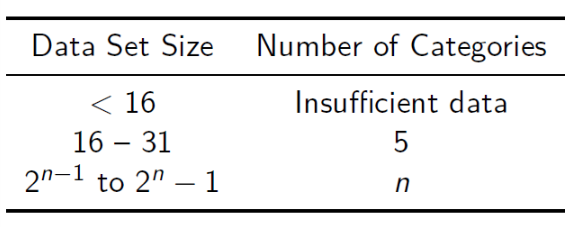

# Introduction to Statistical Method

## Descriptive Statics

-   **population**: a large group of objects about which inferences are to be made.
-   **sample**: a subset of the population
-   at least one **random variable** whose behavior is to be studied relative to the population

### Random Samples

#### Definition

Random sample of size $n$ from the distribution of $X$ is a collection of $n$ independent random variables $X_1, \cdots, X_n$, each with the same distribution as $X$.

$X_1, \cdots, X_n$ are independent identically distributed random variables.

#### Remark

In order to guarantee that the random variables in a random sample are indeed independently distributed, the size of random sample should be not exceed 5% of population.

### Sample Statistics

-   **sample range**: $\begin{align} \max_{1 \leq k \leq n} X_k - \min_{1 \leq k \leq n} X_k \end{align}$
-   **sample mean**: $\begin{align} \overline{X} := \frac 1 n \sum ^n_{k=1} X_k \end{align}$
-   **sample median**: $\tilde{x} = \begin{cases} \frac 1 2 (x _{n/2} + x_{n/2+1}) & \text{n even} \\ x_{(n+1)/2} &\text{n odd}\end{cases}$
-   upper-case letters for statistics (random variables)
-   lower-case letters for observed values of statistics (numbers)
-   **sample variance**: $\begin{align}S^2 = \frac 1 {n-1} \sum^n_{k=1} (X_k - \overline{X})^2 \end{align}$
-   **sample standard deviation**: $S := \sqrt{S^2}$

### Rounding of Statistics

-   For the mean we give **one more decimal place** than the original data has.
-   For the variance we give **two more decimal places** than the original data has.
-   For the standard deviation we give **one more decimal place** than the original data has.
-   The range and median are not rounded.

### Histogram

#### Four Main Properties

-   The number of categories should be suitable for the amount of data. According to Sturges's rule.

-   Each datum should fall into exactly one category.

-   The categories should have the same width.

-   No datum should assume a boundary value.

#### Histogram Creation Steps

-   The desired number of categories (Sturges's rule) 

-   Calculate **data (sample) range**.
-   Divide **data range** by number categories
-   Round up to the accuracy of the data or add a smallest decimal unit at accuracy of data.
-   The **lower boundary for first category** lies **1/2 smallest decimal unit below** smallest datum.

### Percentile and Quartiles

-   **percentile**: $x\text{th}$ percentile is defined as the value $d_x$ of the data such that $x\%$ of the value of the data are less than or equal to $d_x$.
-   **quartile**:
    -   $25\%$ of the data are no greater than **first quartile** $q_1$.
    -   $50\%$ of the data no greater than the **second quartile** $q_2$, equal to the medium $\tilde{x}$.
    -   $75\%$ are no greater than the **third quartile** $q_3$.
-   quartile calculate method
    -   $n$ is even, then first quartile is the median of the smallest $n/2$ elements of the list.
    -   $n$ is odd, then first quartile is the average of the median of the smallest $(n-1)/2$ and the median of the smallest $(n+1)/2$ elements of the list.
    -   the third quartile can be derived in similar method.

### Boxplot

-   $q_1, \tilde{x}, q_3$ and **interquartile range** $iqr := q_3 - q_1$
-   Inner fences: $f_1 = q_1 - \frac 3 2 iqr$, $f_3 = q_3 + \frac 3 2 iqr$
-   Outer fences: $F_1 = q_1 - 3iqr$, $F_3 = q_3 + 3iqr$
-   Adjacent values: $a_1 = \min\{xk : x_k \geq f_1\}$ and $a_3 = \max\{x_k : x_k \leq f_3\}$
-   If the whisker lines are of different length, then the max or min is inside inner fences.
-   Data point lying between inner and outer fences are **near outliers**, with $\circ$ to indicate.
-   Data point lying outside outer fences are **far outliers**, with $*$ to indicate.
-   If outlier seems to be from error in measurement or data collecting, it may be discarded from the data.
-   If outlier seems to come from a random measurement, it is recommended that statistics are reported twice: with the outlier included and without the outlier.
-   Of 100 random sample of a normally distributed population, it can be expected that 7 be outliers.