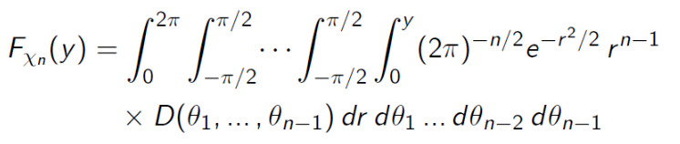

# Introduction to Statistical Method

## Simultaneous Estimation of the Mean and Variance

### Chi Random Variable

Consider a problem:

-   $z= (z_1, \cdots, z_n) \in \mathbb{R}^n$ randomly chosen.
-   the value $z_k$ is determined by random variable $Z_k$, following a standard normal distribution.
-   think about distribution about $\chi_n := \sqrt {\sum^n_{i=1}Z_i^2}$
-   $\chi_n$ is a chi random variable, follows chi distribution with $n$ degree of freedom.

#### Cumulative Distribution Function

$\begin{align}F_{\chi_n}(y) = P[\chi_n \leq y] = P[\chi_n^2 \leq y^2] = P[\sum^n_{i=1}Z_i^2 \leq y^2] = \int_{\sum^n_{k=1} z_k^2 \leq y^2} f_{Z_1 ...Z_n} (z_1, \cdots, z_n) dz_1 ...dz_n\end{align}$

Since they are $Z_1, ...Z_n$ that $n$ independent standard variables, then we see the joint density:

$\begin{align}f_{Z_1 ...Z_n}(z_1, ...z_n) = \frac 1 {(2\pi)^{n/2}}e^{-\sum^n_{k=1}z_k^2/2}\end{align}$

Thus $\begin{align}F_{\chi_n}(y) = \int_{\sum^n_{k=1}z_k^2 \leq y^2} (2\pi)^{-n/2}e^{-\sum^n_{k=1}z_k^2/2} dz_1 ...dz_n \end{align}$

Apply polar coordinate with $(r, \theta_1, ..., \theta_0)$ with $r > 0$, $0 < \theta_{n-1} < 2\pi$ and $-\pi/2 < \theta_k < \pi/2$ for $k=1,...n-2$:

Then the integral become: 

Since $D(\theta_1, ...\theta_{n-1})$ is independent of $r$, $\begin{align}C_n = (2\pi)^{-n/2}\int^{2\pi}_0\int^{\pi/2}_{-\pi/2}\cdots \int^{\pi/2}_{-\pi/2}D(\theta_1,...\theta_{n-1})d\theta_1\cdots d\theta_{n-1}\end{align}$

we have $\begin{align}F_{\chi_n}(y) = C_n \int^y_0e^{-r^2/2}r^{n-1}dr\end{align}$.

Obviously, the $\begin{align} 1 = \lim_{y\to \infty} C_n \int _0^\infty e^{-r^2/2}r^{n-1}dr = C_n\Gamma(\frac n 2)2^{n/2-1}\end{align}$

Thus $C_n = (\Gamma(\frac n 2)2^{n/2-1})^{-1}$ and $f_{\chi_n}(y) = \frac 2 {\Gamma(\frac n 2)2^{n/2}} y^{n-1} e^{-y^2/2}$

### Chi-Squared Distribution

we hence derive from the $\begin{align}F_{\chi_n^2} =(\Gamma(\frac n 2)2^{n/2-1})^{-1} \int ^{\sqrt y}_0 e^{-r^2/2} r^{n-1} dr \end{align}$

$\begin{align}f_{\chi_n^2} = F'_{\chi^2_n}(y) = (\Gamma(\frac n 2)2^{n/2-1})^{-1} e^{-y/2} \sqrt y ^{n-1} \cdot \frac d {dy} \sqrt y = \frac 1 {2^{n/2}\Gamma(\frac n 2)}y^{n/2-1}e^{-y/2}\end{align}$

### Sum of Independent Chi-Squared Variables

Given $\begin{align} \chi_m^2 = \sum^m_{i=1}X_i^2 \end{align}$ and $\begin{align} \chi_n^2 = \sum^n_{j=1}Y_j^2 \end{align}$, then $\begin{align} \chi_{m+n}^2 = \chi_m^2 + \chi_n^2 = \sum^m_{i=1}X_i^2 + \sum^n_{j=1}Y_j^2\end{align}$

It follows a chi-squared distribution, but with $m+n$ degree of freedom.

It extends to multi-addition case, trivial.

### Joint Sampling of Mean and Variance

In the previous chapter, we were able to analyze the sample mean, and also its distribution, under the assumption of known variance.

If variance $\sigma^2 = E[(X -\mu)^2]$ is unknown, then we must first see $S^2 = \frac 1 {n-1}\sum^n_{k=1}(X_k-\overline X)^2$

So we are using the random sample $X_1, \dots X_n$ to get $\overline X $ and $S^2$ at same time.

So we are getting the joint distribution of $\overline X$ and $S^2$.

#### Theorem

##### Predicate

-   $X_1, \dots X_n$ $n \geq 2$ be a random sample of size $n$.
-   Normal distribution with $\mu$ and variance $\sigma^2$.

##### Content

-   The sample mean $\overline X$ is independent of the sample variance $S^2$.
-   $\overline X$ is normally distributed with mean $\mu$ and $\sigma^2 / n$.
-   $(n-1)S^2/\sigma^2$ is chi-squared distributed with $n-1$ degree of freedom.

### Helmert Transformation

The Helmert transformation is a very special kind of orthogonal transformation from a set of $n \geq 2$ normal random variables $X_1, \dots X_n$ to a new set of random variables $Y_1, \dots Y_n$.

The matrix $A$ is orthonormal since $A^{-1} = A^T$. This implies $|\det A| = 1$.

$\begin{align}\sum^n_{i=1}y_i^2 = \langle y,y \rangle = \langle Ax, Ax\rangle = (Ax)^T(Ax) = x^TA^TAx = \langle A^TAx, x\rangle = \langle x , x\rangle = \sum ^ n _{i=1} x_i^2 \end{align}$

Thus the joint distribution: 

Apply back into the $y_n$, 

Then $\begin{align} f_{Y_1}(y_1) = (2\pi)^{-1/2}\sigma^{-1}e^{-\frac 1 {2\sigma^2}(y_1 - \sqrt n \mu)^2} \end{align}$ and $\begin{align} f_{Y_i}(y_i) = (2\pi)^{-1/2}\sigma^{-1}e^{-\frac 1 {2\sigma^2} y_i^2} \end{align}$ for $2 \leq i \leq n$.

$f_{Y_1\dots Y_n}(y_1, \dots y_n) = f_{Y_1}(y_1)\cdot f_{Y_2}(y_2) \dots f_{Y_n}(y_n)$

So $Y_1$ is normally distributed with mean $\sqrt n \mu$ and variance $\sigma^2$, while $Y_2 \dots Y_n$ are having mean 0 and variance $\sigma^2$.

### Proof for Previous Theorem

So $\overline X = n^{-1/2} Y_1$ and $\begin{align}(n-1)S^2 &= \sum^n_{k=1}(X_k - \overline X)^2 = \sum^n_{k=1}X_k^2 - 2\sum^n_{k=1}X_k\overline X + n\overline X^2\\& = \sum^n_{k=1}X_k^2 - n\overline X^2 = \sum^n_{k=1}Y_k^2 - Y_1 ^2= \sum^n_{k=2}Y_k^2\end{align}$

Since $\overline X = n^{-1/2} Y_1$ and $\begin{align} f_{Y_1}(y_1) = (2\pi)^{-1/2}\sigma^{-1}e^{-\frac 1 {2\sigma^2}(y_1 - \sqrt n \mu)^2} \end{align}$, then according to the rule in `ve401 note 3 page 6` that we get $\begin{align}f_{\overline X}(x) = (2\pi)^{-1/2}\sigma^{-1}e^{-\frac 1 {2\sigma^2}(\sqrt n x - \sqrt n \mu)^2}\sqrt n \end{align}$

So the $\overline X$ is normally distributed with mean $\mu$ and variance $\sigma^2 / n$.

$(n-1)S^2 / \sigma^2 = \frac 1 {\sigma^2} \sum^n_{k=2}Y_k^2 = \sum^n_{k=2} (\frac {Y_k} \sigma)^2$ is a chi-squared distribution with $n-1$ freedom.

### Independence of Sample Mean and Sample Variance in more General Form

