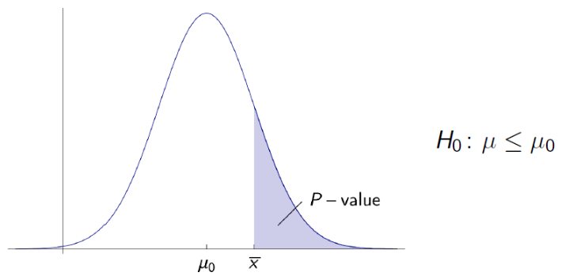
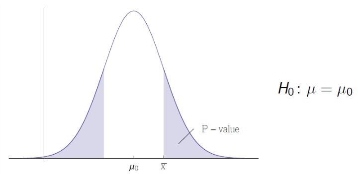
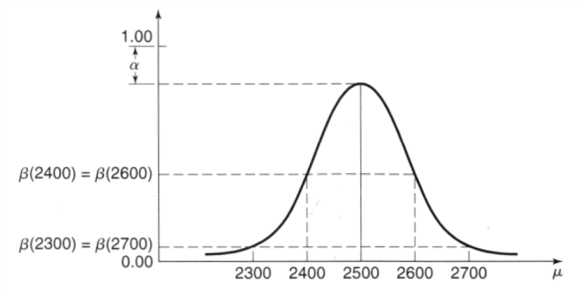
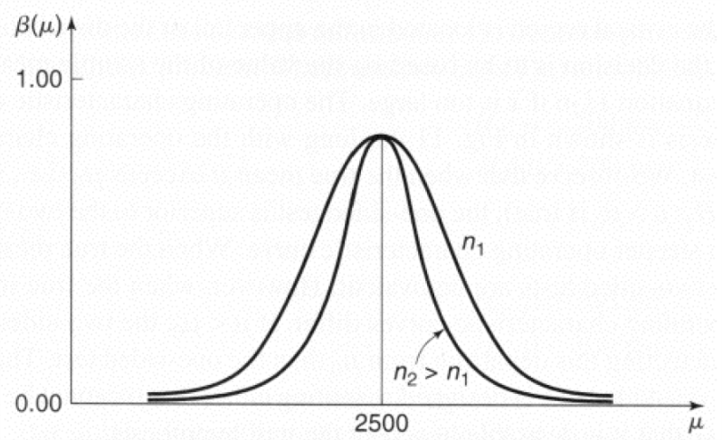
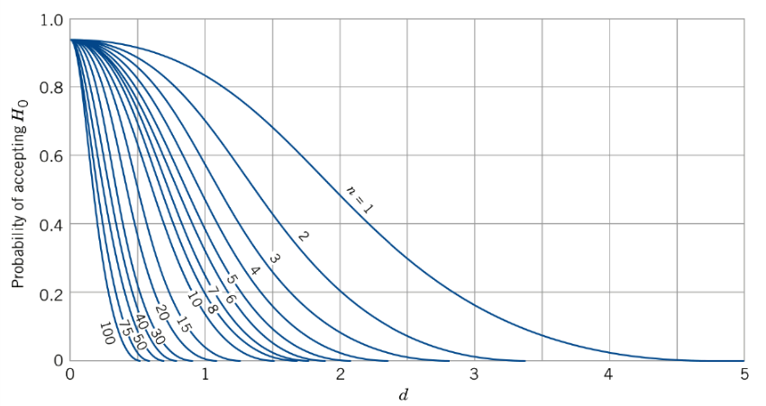
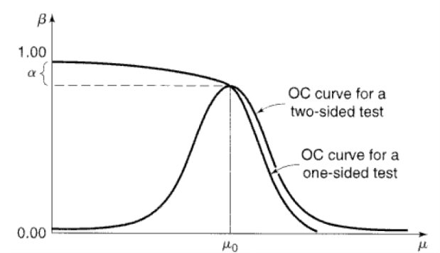
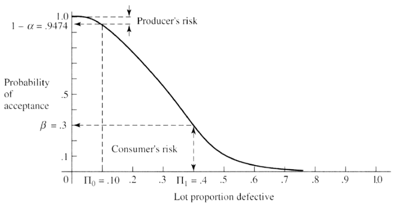

# Introduction to Statistical Method

## Hypothesis Testing

A second major statistical method for gaining information on a probability.

The goal is to reject or fail to reject statements (hypotheses) based on statistical data.

### Hypothesis Definition

A statement about a population parameter $\theta$. The hypothesis will compare $\theta$ to a null value donated $\theta_0$.

### Fisher's Null Hypothesis Test

This hypothesis will be donated by $H_0$ and is null hypothesis.

Three forms: $H_0: \theta = \theta_0$ or $H_0: \theta\leq \theta_0$ or $H_0: \theta \geq \theta_0$.

A hypothesis test is based on rejecting a hypothesis.

### One-Tailed Test

The test of a hypothesis of the form $H_0:\theta \leq \theta_0$ or $H_0: \theta \geq \theta_0$ is said to be one-tailed tests.

### P-Value for a One-Tailed Test

-   Apply an example first

    We want to find evidence that a new car design has a mean mileage greater than 26 mpg. Therefore, we set up the null hypothesis: $H_0: \mu \leq 26$.

    The goal is to reject the null hypothesis.

-   Example explanation

    We take a random sample and calculate $\overline X$, if it is much greater than 26, then there is reason to believe that $H_0$ is false.

    Take a random sample of size $n$ and find the value $\overline x$ for the sample mean.

    The probability of obtaining the measured value of $\overline x$ or a larger result if $H_0$ is true is the **significance** or **P-Value** of the test.

    (TM还是说中文吧：就是说，猜测$\mu \leq 26$，然后我们得到了样本的平均的观测值$\overline x$，根据样本个数和标准差，我们可以对样本的平均值$\overline X$得到基于$\mu \leq 26$的test，然后可以放宽到$\mu =26$，然后可以用$Z = \frac {\overline X - \mu_0}{\sigma / \sqrt n}$算出$P$的值来判断这个样本是否符合这个假设)

    $P[\overline X \geq \overline x | \mu \leq 26] \leq P[\overline X \geq \overline x | \mu = 26]$

     shows the case if $\mu = \mu_0$, the curve shift left if $\mu < \mu_0$.

    The shaded area shows the probability of obtaining $\overline X \geq \overline x$ if $\mu = \mu_0$.

-   The P-value is therefore an upper bound of the probability of obtaining the data if $H_0$ is true.

-   $P = P[D | H_0]$ if $D$ represents the statistical data, we will reject $H_0$ if it is small.

    So either:

    -   fail to reject $H_0$ at $P$ level of significance
    -   reject the $H_0$ at $P$ level of significance

    The statistic on which the $P$ is based is **test statistic**.

### Two-Tailed Test

If we are testing a hypothesis of the form $H_0: \theta = \theta_0$, we say we are performing a two-tailed test.

 The $P$ is twice the value of one-tailed test.

### Does a Small P-Value Provide Evidence that H0 is False

Since we know the fact that the $P  = P[D|H_0]$, but some researcher want $P[H_0|D]$.

We can derive the fact from the Bayes's theorem:

$P[D| H_0] = P[D \cap H_0] / P[H_0]$, then we can derive $P[H_0 | D] = P[D \cap H_0]/P[D]$.

$\begin{align}P[H_0|D] &= \frac {P[D\cap H_0]}{P[D]} = \frac {P[D| H_0]\cdot P[H_0]}{P[D]} = \frac{P[D| H_0]\cdot P[H_0]}{P[D|H_0] \cdot P[H_0] + P[D|\neg H_0]\cdot(1-P[H_0])}\\&=\frac{P[D| H_0]}{P[D|H_0] + P[D|\neg H_0]\cdot(\frac{1-P[H_0]}{P[H_0]})}\end{align}$

### Is Hypothesis Testing Logical?

Since we get the $P[H_0|D]$ representation, we can let it be close to 1 depending on $P[H_0]$.

Hence, it is possible that: given $H_0$ and the data is very unlikely, but given the data $H_0$ is very likely.

-   In the classic argument:

    If $P$ then $Q$; not $Q$ therefore not $P$

-   In hypothesis testing, we want to argue that

    If $P$ then $Q$; $Q$ is unlikely therefore $P$ is unlikely

    Actually this is wrong.

### Bayesian & Frequentist Statistics

#### Bayesian

Claim to understand the **logical inconsistencies** and intend to compensate for them with **prior and posterior probability** distributions.

Theoretically true, difficult to implement in practice.

#### Frequentist

Mainly ignore the problems mentioned here or claim that they are not relevant in their specific research.

### Neyman-Pearson Decision Theory

Two competing hypothesis: $H_0,H_1$.

Seek to reject $H_0$ to accept $H_1$.

-   $H_0$ is **null hypothesis**
-   $H_1$ is **research hypothesis** or **alternative hypothesis**.

So there are four possible outcomes of the decision-making process:

-   We reject $H_0$ when $H_0$ is untrue.
-   **Type I Error**: We reject $H_0$ even though $H_0$ is true.
-   **Type II Error**: We fail to reject $H_0$ even though $H_0$ is untrue.
-   We fail to reject $H_0$ when $H_0$ true.

Type I and Type II error should be as small as possible.

### Power, Type I & II Error Probabilities

$\alpha = P[\text{Type I Error}] = P[\text{reject $H_0$ | $H_0$ true}] = P[\text{accept $H_1$ | $H_1$ false}]$

$\beta = P[\text{Type II Error}] = P[\text{fail to reject $H_0$ | $H_0$ false}]$

$\text{Power} = 1-\beta$

The power shows how likely our experiment is successful.

-   By requiring strong evidence before rejecting $H_0$ (a value of the test statistic that is very different from its null value), $\alpha$ can be made small.

-   The range of values for the test statistic that causes us to reject $H_0$ is **critical region**.

    We choose the critical region in such a way to make $\alpha$ small.

-   The more evidence we require to reject $H_0$ (the smaller the critical region is), the harder it is to actually reject $H_0$ in the first place.

    The power decreases with $\beta$ becomes larger.

-   For given $H_0$ and $H_1$, $\beta$ can be controlled by increasing the sample size.

### Example of Neyman-Pearson Decision Theory

The mean is supposed to be $\mu_0 = 40$ and the standard deviation is $\sigma = 2$.

Two hypothesis $H_0: \mu = 40$, $H_1: |\mu-40| \geq 1$

Then the sample size is $n = 25$.

The probability of committing Type I Error is $\alpha \leq 5\%$. (derive from $H_0$ and $H_1$?)

So we apply the test statistic $\begin{align}Z = \frac {\overline X - \mu_0}{\sigma / \sqrt n} \end{align}$ and let $-z_{\alpha / 2}\leq Z \leq z_{\alpha / 2}$ to get probability of $1-\alpha$ and $P[|Z| > z_{\alpha / 2}] = \alpha$.

The $\begin{align} \Big|  \frac {\overline X - \mu_0}{\sigma / \sqrt n} \Big| \geq 1.96 \end{align}$ is the critical region, with this critical region there are $5\%$ of Type I Error.

If the sample mean is $\overline x = 40.9$, then the test statistic is $z = 2.25 > 1.96$.

### Type II Error

$\begin{align}|Z| =\Big| \frac {\overline X - \mu_0}{\sigma / \sqrt n}\Big| \geq z_{\alpha / 2} = 2.575 \end{align}$ when $\alpha = 1\%$. So with $z = 2.25 < 2.575$, there is a Type II Error.

Assume null hypothesis $H_0 : \mu = \mu_0$ and the true value is $\mu = \mu_0 + \delta, \delta \in \mathbb{R}\backslash \{0 \}$.

$\begin{align}Z = \frac {\overline X - \mu_0}{\sigma / \sqrt n}\end{align}$ is the test statistic actually follows a normal distribution with unit variance and mean $\delta \sqrt n / \sigma$.

Review that if $-z_{\alpha / 2}\leq Z \leq z_{\alpha / 2}$ then we cannot reject $H_0$, deriving the Type II Error.

$\begin{align}\beta = P[|Z|\leq z_{\alpha  /2}] = \frac 1 {\sqrt {2\pi}} \int^{z_{\alpha/2}}_{-z_{\alpha / 2}} e^{-(t-\delta \sqrt n / \sigma)^2 / 2}dt \approx\frac 1 {\sqrt {2\pi}} \int^{z_{\alpha/2} - \delta \sqrt n / \sigma}_{-\infty} e^{-t^2/2}dt \end{align}$

We donate $-z_{\beta} \approx z_{\alpha / 2} - \delta \sqrt n / \sigma$ or $n \approx \frac {(z_{\alpha / 2} + z_\beta)^2 \sigma^2}{\delta ^2}$

Given a critical region determined by $\alpha$, we can find a sample size $n$ so that the probability of committing a Type II Error is $\beta$.

### Remark

In order for the statistical procedure to be valid, **a critical region must be fixed before any data obtained**.

### Operating Characteristic (OC) Curves

The previous probability of Type II Error is calculated directly. For distribution other than normal distribution with known variance is different. These probability are often provided as OC curves.

According to **central limit theorem**, $\overline X$ follows a normal distribution with mean $\mu$.

Through our **choice of critical region** and sample size, we can effectively fix $\alpha$.

Depending on the true value of $\mu$, $\beta$ can be large or small.

We represent $\beta$ as function of $\mu$ through a curve:

$\beta(\mu) = P[\text{fail to reject $H_0$ | $\mu$}]$ and when $\mu \to \mu_0$ the $\beta(\mu)\to P[\text{fail to reject $H_0$ | $\mu=\mu_0$}] = 1-\alpha$

Also, the $\beta$ depends on the sample size, a larger sample size reduces the variance of $\overline X$ and **make it less likely to reject $H_0$ if $\mu \neq \mu_0$**. 

### OC Curves for Normal Distribution

The OC curve for $\alpha = 0.05$ to find $\beta$:  

where $d := \frac {|\mu - \mu_0|}\sigma$

### One-Tailed Tests

The one tailed hypothesis of form $H_0 :\theta \leq \theta_0, H_1:\theta\geq \theta_1$ or $H_0:\theta\ge \theta_0, H_1:\theta\le \theta_1$ also has OC curve.

The $\alpha = \alpha (\theta)$ depends on the actual value of $\theta$. $\alpha(\theta_0)$ gives an upper bound for all $\alpha(\theta)$.

### OC for One-Sided Hypotheses

One sided test with null hypothesis $H_0: \mu \le \mu_0, H_1: \mu > \mu_0 $ then we can only define $\beta(\mu)$ for $\mu > \mu_0$.

Since $\beta(\mu_0) = 1-\alpha(\mu_0)$ and we have a $\alpha = \alpha(\mu)$ for $\mu \leq \mu_0$, we just use $\beta(\mu) = 1-\alpha(\mu)$ for $\mu \leq \mu_0$.

### Acceptance Sampling

>   An important part of statistical quality control.

Suppose a situation:

-   A buyer receives a lot of items from a producer
-   He needs to decide upon delivery whether or not to accept the lot
-   It is impractical to test all items in the lot on whether they are acceptable
-   A sample is tested, and each item in the sample categorized as **defective or acceptable**
-   Based on the number of defective in the sample, a decision is made on whether or not accept.

We denote the number of items in the lot by $N$.

The true but unknown proportion of defectives is donated by $\Pi$.

So we set $H_0: \Pi \le \Pi_0$ and $H_1:\Pi > \Pi_1$

Usually, one defines an acceptance number $c$. If the number of defective items in sample exceeds $c$, reject. Choosing $c$ corresponds to setting a critical region for the test.

Type I error corresponds to rejecting an acceptable lot, producer's risk $\alpha$.

Type II error corresponds to failing to reject an unacceptable lot, consumer's risk $\beta$.

#### Producer's Risk

We can calculate $\alpha$ based on the $N$, $n$ and $\Pi_0$.

Trivially, $r = N\Pi$, we select a sample of size $n$ from the lot and consider random variable $D$ as the number of defective items in the sample.

$\begin{align}f_D(d) = P[D = d] = \frac {\binom r d \binom {N-r}{n-d}}{\binom N n} \end{align}$

Then we can derive $\alpha = P[\text{reject $H_0$ | $\Pi \le \Pi_0$}] \le P[\text{reject $H_0$ | $\Pi = \Pi_0$}] = P[D > c | \Pi = \Pi_0]$

Thus we get $\begin{align}\alpha = \sum_{d > c}f_D(d) \end{align}$

We can apply Poisson or Binomial Approximation to this Hypergeometric distribution.

#### Consumer's Risk

Given the acceptance number $c$, we can calculate the probability of Type II Error.

This depends on $\Pi$ and must be calculated for each value of  $\Pi$.

$\beta = \beta(\Pi) \le P[\text{fail to reject $H_0$ | $\Pi = \frac r N > \Pi_0$}] = \sum_{d \leq c} f_D(d)$

Then for different $\Pi$ we generate different $\beta$.

Then fixes $\alpha$ we get the OC curve for producer's risk and consumer's risk.

### Summary of Neyman-Pearson Decision Theory

-   Select appropriate hypothesis $H_0, H_1$ and a test statistic
-   Fix $\alpha$ and the critical region for test
-   Choose a sample size and hence a desired power for test.
-   Obtain the sample statistic and judge:
    -   if it falls into critical region, reject $H_0$ at significance level $\alpha$
    -   otherwise accept $H_0$

### Null Hypothesis Significance Testing (NHST)

-   Two hypotheses $H_0, H_1$ are setup, $H_1$ is always the logical negation of $H_0$
-   Either a "hypothesis test" is performed, where a critical region for given  $\alpha$ is performed, test statistic is evaluated, $H_0$ is either rejected or accepted.
-   Or test statistic is evaluated immediately, a P-value is found and $H_0$ is either rejected or accepted based on the value.
-   Since $H_1$ is always $\neg H_0$, there is no meaningful discussion of $\beta$.

### NHST Disadvantages

-   A small P-value doesn't guarantee that a large probability that $H_0$ is false.
-   Rejecting $H_0$ on $\alpha = 0.05$ or $0.01$ is just arbitrary
-   NHST is actually biased against failing to reject $H_0$, based on a Bayesian point of view, $P[H_0]$ doesn't enter into NHST.
-   The two-sided test like $H_0 : \theta = \theta_0$ and $H_1:\theta \ne \theta_0$ is meaningless
-   The power of the test is nor properly defined.

### T-Test

$X_1, ...X_n$ be random sample of size $n$ from a normal distribution.

$\overline X$ donate the sample mean, $S^2$ the sample variance.

$\mu$ be the unknown population mean and $\mu_0$ a null value for the mean.

Then any test $H_0: \mu = \mu_0$ based on the statistic $T_{n-1} = \frac {\overline X - \mu_0}{S / \sqrt n}$ is T-test.

We reject at significance level $\alpha$:

-   $H_0: \mu = \mu_0$ if $|T_{n-1}| > t_{\alpha / 2, n-1}$
-   $H_0: \mu \leq \mu_0$ if $T_{n-1} > t_{\alpha, n-1}$
-   $H_0:\mu \geq \mu_0$ if $T_{n-1} < -t_{\alpha, n-1}$

#### T-Test OC Curves

The OC curves for T-test have a similar appearance to those for the normal distribution.

The OC curves for T-distribution has $d = \frac{|\mu - \mu_0|}\sigma$ where $\sigma$ is the unknown standard deviation of the random variable.

-   If available, we can use prior experiments to insert a rough estimate for $\sigma$
-   We can express the difference $\delta = |\mu - \mu_0|$ relative to $\sigma$
    -   presecribing $d=\delta / \sigma < 1$ for a small difference in the mean
    -   $d = \delta / \sigma < 2$ for a moderately large difference
-   Substitute the sample standard deviation $s$ for $\sigma$

### Chi-Squared Test

$X_1, ...X_n$ be random sample of size $n$ from a normal distribution.

$\overline X$ donate the sample mean, $S^2$ the sample variance.

$\sigma^2$ for unknown population variance and $\sigma^2_0$ a null value of variance.

Then a test for the variance based on the statistic $\chi^2_{n-1} = \frac {(n-1)S^2}{\sigma^2_0}$ is called chi-squared test.

We reject at significance level $\alpha$:

-   $H_0 : \sigma = \sigma_0$ if $\chi^2_{n-1} > \chi^2_{\alpha / 2, n-1}$ or $\chi^2_{n-1} < \chi^2_{1-\alpha / 2, n-1}$
-   $H_0: \sigma \leq \sigma_0$ if $\chi^2_{n-1} > \chi^2_{\alpha, n-1}$
-   $H_0:\sigma \geq \sigma_0$ if $\chi^2_{n-1} < \chi^2_{1-\alpha, n-1}$

